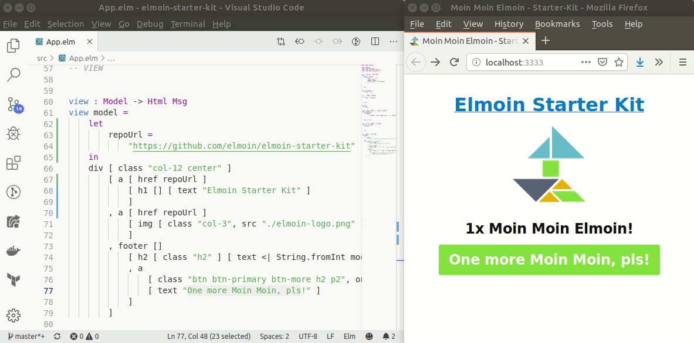

## Whaaaat?

_Simple boilerplate_ to hack nicely around with [Elm](http://elm-lang.org/) at [Elmoin Meetups](http://www.meetup.com/de-DE/Elmoin/) and anywhere else.

Without any `Schnickschnack` `[ˈʃnɪkˌʃnak]` (meaning: Just all you need, nothing more).

It just includes:
- [Webpack](https://webpack.github.io/)
- Hot Module Replacement (HRM) by [elm-hot-loader](https://github.com/fluxxu/elm-hot-loader)
- [Basscss](http://www.basscss.com/) - if you want to make your app fancy

## Installation

```
git clone https://github.com/elmoin/elmoin-starter-kit.git {your-project}
cd {your-project}
npm i
npm start
```
Open [http://localhost:3333](http://localhost:3333) in your browser.

_Hint:_ To remove all git history just run `rm -rf .git` from your `{your-project}` folder.


## License

[MIT](./LICENSE)


_Moin Moin Elmoin && have fun :)_
