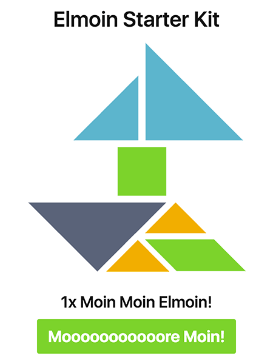

# Elmoin Starter Kit

Simple boilerplate for [Elm](http://elm-lang.org/) used at [Elmoin Meetups](http://www.meetup.com/de-DE/Elmoin/).

Without any `Schnickschnack` `[ˈʃnɪkˌʃnak]`. Meaning: Just all you need to hack around with [Elm](http://elm-lang.org/) - nothing more.

## Includes

- [Webpack](https://webpack.github.io/)
- Hot Module Replacement (HRM) by [elm-hot-loader](https://github.com/fluxxu/elm-hot-loader)
- [MaterializeCSS](http://materializecss.com/) - just in case you need some nice styles for your stuff

## License

[MIT](./LICENSE)

Have fun!
